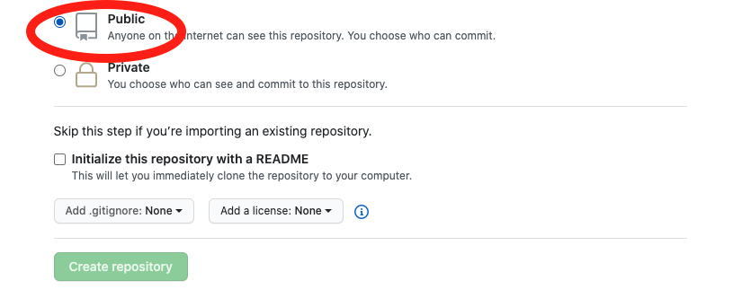

 

# Guide to the ESS-DIVE Community Space

This is a meta-repository for users of the ESS-DIVE community GitHub space. The contents of this repository will help users become familiar with typical workflows involved in starting, maintaining, and contributing to repositories in this Community Space on GitHub.

## Table of contents
- Chapter 1 - An brief introduction to GitHub
- Chapter 2 - Starting a new repository
- Chapter 3 - Developing a data reporting format on GitHub
- Chapter 4 - Submitting a data reporting format to ESS-DIVE

## The purpose of the Community Space

The ESS-DIVE GitHub Community Space was started to provide a location where the ESS-DIVE user community can upload documents, codes, and tools related to the [ESS-DIVE repository](http://ess-dive.lbl.gov/). We designed this meta-repository so that ESS-DIVE contributors can familiarize themselves with the process of contributing to an existing GitHub repository or starting their own.

--- 
## How to contribute
### Setting up a  GitHub account 
The first step for anyone interested in contributing to the ESS-DIVE GitHub community space is to go to the [GitHub website](https://github.com/) and create a GitHub account or sign in if you already have an account. 

Then, login and navigate to our ESS-DIVE Community Space on GitHub https://github.com/ess-dive-community

##  Suggesting changes to an existing repository
If you would like to suggest changes to this, or any other repository in our community space, the best way to do so is by submitting a GitHub "issue". When someone submits an issue, the person or team managing the repository is notified, and then developers and the user community can collaborate on steps to solve the issue.   

To submit an issue, first make sure you are logged into your GitHub account. Then, navigate to the repository you would like to submit an issue to. Click the "issue" link toward the top of this repository's page (shown below). If you are having any difficulties accessing a repository or submitting an issue, you can email us at ESS-DIVE support with questions.

## Starting a new repository
We welcome new repositories from ESS-DIVE users that are creating software, documents, or tools related to the ESS-DIVE repository. Prior to creating a new repository, please email ESS-DIVE support to express your interest in contributing to the community space.

When you are ready to start a new repository on the ESS-DIVE Community Space click the green "New" button on the Community Space homepage.

On the next screen, you will be prompted to create a name for your repository. We encourage you to pick a repository name that is short and **uses dashes between words**. For example, the name of this repository is community-repo-guide.

Scrolling down the page, you can enter a description for your repository and then choose whether your repository is public or private. In the interest of creating open and freely available community resources, we ask that all repositories are publicly available. 

Your last step before creating your repository is to create a README file. By checking this option, a README.md file will automatically appear in your new repository. 

## How to contribute to this repository
The easiest way to contribute to this repository, or any chapter within the repository, is by submitting a GitHub issue.

## Copyright information  
Copyright information about the Community Space will be updated soon

## Funding and acknowledgements  
ESS-DIVE is funded by the U.S. Department of Energy, Office of Science, Office of Biological and Environmental Research, Climate and Environmental Science Division, Data Management program under contract number DE-AC02-05CH11231. 

ESS-DIVE uses resources of the National Energy Research Scientific Computing Center (NERSC), a DOE Office of Science User Facility operated under Contract No. DE-AC02-05CH11231. 

## Recommended citation  
Recommended citation will be updated when this repository is stored in the ESS-DIVE repository
